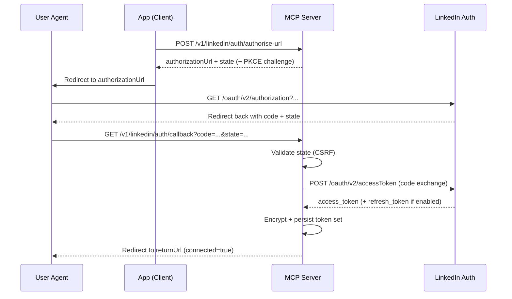
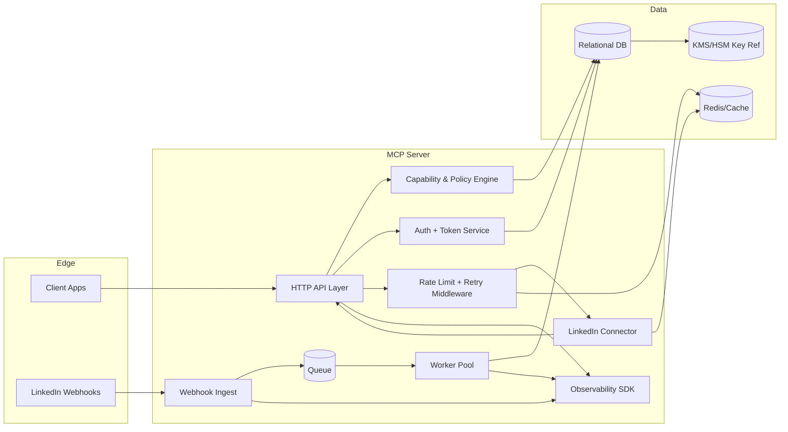

# Designing a LinkedIn HTTP MCP Server

## Executive summary

A pragmatic LinkedIn MCP (Member Control Plane) server must start from one reality: most valuable LinkedIn APIs are gated behind product approvals, partner programmes, and tiering, and the “open” surface area is intentionally narrow (notably OpenID Connect sign-in + basic sharing). citeturn16view0turn9view0turn17view1 A robust MCP therefore needs (1) **capability discovery**, (2) **strict scope-aware routing**, and (3) **policy-driven data handling** so you can ship one stable integration while features unlock as approvals arrive.

Key design choices in this report:

- Treat LinkedIn integration as **multi-product**: Consumer (OIDC sign-in, member sharing), Marketing (Community Management, Ads), plus optional gated surfaces (Profile/People, Connections, Communications/Messaging). citeturn16view0turn16view3turn3view2turn13view0turn3view3  
- Normalise two LinkedIn API “styles” under one MCP contract:
  - **v2** base path: `https://api.linkedin.com/v2/...` (still used for several resources). citeturn3view2turn13view0turn17view0  
  - **Versioned REST** base path: `https://api.linkedin.com/rest/...` with mandatory `Linkedin-Version: YYYYMM`, on a monthly release cadence and ~1 year support window. citeturn5view0
- Implement **protocol correctness as middleware**: always send `X-Restli-Protocol-Version: 2.0.0`; handle list syntax + URL encoding rules; support query tunnelling to avoid URL length issues. citeturn5view4turn5view1turn3view10turn3view11  
- Engineer for operational safety: LinkedIn rate limits are day-based (reset at midnight UTC), can be both app-level and member-level, often not published per endpoint, and 429s can also occur as “infrastructure protection”. citeturn6view0  
- Make compliance non-negotiable: deletion-on-request, explicit consent to store profile data, tight retention for stored marketing data, and GDPR-aligned storage limitation must be built into data models and runbooks. citeturn14search3turn14search0turn14search16turn15search1turn14search6  

The remainder delivers two concrete artefacts:

- **Functional design**: use cases, MCP HTTP API surface with examples, OAuth flows, mermaid sequence diagrams, and core data models.
- **Technical design**: architecture (mermaid), component responsibilities, DB schema, caching/TTL proposals, rate-limit and retry algorithms, error-handling matrix, security controls, CI/CD + test plan, and an operational runbook.

## Scope, assumptions, and constraints

**Scope.** This MCP is a dedicated HTTP server that centralises LinkedIn member-connected workflows: connect accounts, read basic identity/profile, read/manage organisations where permitted, publish posts, manage ads, retrieve analytics, process webhooks, and enforce platform/compliance constraints.

**Assumptions (explicit).**

- Multi-tenant SaaS MCP used by internal services and/or customer-facing apps.
- Default patterns: RESTful JSON, OAuth2 auth-code flow, stateless API pods + separate worker pool.
- Token lifetimes: LinkedIn access tokens commonly 60 days; refresh tokens (if enabled for the app) can be ~1 year, with the expectation that LinkedIn may revoke tokens and you must fall back to standard OAuth. citeturn3view1turn3view7  
- Marketing APIs: require **3-legged member authorisation**; client credentials flow is not available for marketing use cases. citeturn9view0turn20view0  
- Dev/test: some “development tiers” are still backed by production data, and specific programmes restrict daily calls and even disallow BATCH_GET and webhooks in dev tier. citeturn16view1turn16view2  

**Constraints imposed by LinkedIn platform design (non-negotiable).**

- Many endpoints are explicitly **restricted to approved partners / agreements** (Profile/People, Connections, Messages/Invitations, and others). citeturn3view2turn3view3turn13view0turn13view1turn17view3  
- The versioned `/rest` API requires `Linkedin-Version` and does not default to “latest”, with monthly versions that sunset after a time window (~12 months minimum support). citeturn5view0turn7view0  
- Webhooks require explicit enablement, HMAC-based validation, periodic re-validation, and signature verification for each event. citeturn22view0  

## LinkedIn API landscape for MCP workflows

### Primary sources

The authoritative doc set for LinkedIn APIs is now largely hosted on **Microsoft Learn**, while product discovery and legal terms sit on LinkedIn’s developer and legal properties. citeturn16view3turn16view0turn14search3turn14search16  

For convenience, here are key primary-source entry points (URLs are provided because you requested explicit links):

```text
https://learn.microsoft.com/en-us/linkedin/shared/authentication/getting-access
https://learn.microsoft.com/en-us/linkedin/shared/authentication/authorization-code-flow
https://learn.microsoft.com/en-us/linkedin/shared/authentication/programmatic-refresh-tokens
https://learn.microsoft.com/en-us/linkedin/shared/api-guide/concepts/rate-limits
https://learn.microsoft.com/en-us/linkedin/shared/api-guide/concepts/error-handling
https://learn.microsoft.com/en-us/linkedin/shared/api-guide/webhook-validation
https://learn.microsoft.com/en-us/linkedin/marketing/versioning?view=li-lms-2026-02
https://www.linkedin.com/legal/l/api-terms-of-use
https://www.linkedin.com/legal/l/marketing-api-terms
https://legal.linkedin.com/storing-member-data
```

### API styles you must support

**v2 APIs (`/v2/...`)**  
Common for identity, some social/UGC, communications, etc. Examples include `/v2/me`, `/v2/userinfo`, `/v2/messages`, `/v2/invitations`, `/v2/ugcPosts`. citeturn17view0turn17view1turn13view0turn13view1turn4search19  

**Versioned REST APIs (`/rest/...`)**  
Marketing surfaces (Community Management, Ads, analytics) increasingly standardise on `/rest` plus:
- `Linkedin-Version: YYYYMM` required; monthly cadence; versions supported for at least one year; no “latest by default”. citeturn5view0  
- `X-Restli-Protocol-Version: 2.0.0` expected in request headers. citeturn5view0turn5view4  

### Protocol, encoding, projections, and decoration

LinkedIn’s v2 APIs support protocol versions 1.0 and 2.0, defaulting to 1.0 if you omit `X-Restli-Protocol-Version`, with deprecation planned for 1.0. citeturn5view4 Protocol 2.0 changes how you encode resource keys and how you represent multi-IDs (using `List(...)`). citeturn5view4  

Field selection is supported via projections (for some docs `&fields=`; elsewhere `projection=(...)`), and “decoration” can expand URN references inline, although decoration is deprecated in some LMS versions and you must track version-specific behaviour. citeturn5view2turn5view3turn8search19  

When requests become too long (common in analytics and social-actions queries), LinkedIn supports **query tunnelling**: convert `GET` to `POST`, add `X-HTTP-Method-Override: GET`, move the query string into the form-encoded body. citeturn5view1turn3view11turn4search17  

### Official endpoints and scopes relevant to MCP workflows

The table below groups MCP-relevant LinkedIn endpoints (not exhaustive), plus scopes and gating notes. When a scope is not explicitly stated in the endpoint’s doc page, treat it as “programme-dependent” and enforce capability checks using token introspection + known product entitlements. citeturn18view0turn16view0  

| Workflow area | Official endpoint(s) | Method(s) | Typical scope(s) | Notes / gating |
|---|---|---|---|---|
| Member auth (3-legged) | `https://www.linkedin.com/oauth/v2/authorization` → `https://www.linkedin.com/oauth/v2/accessToken` | GET/POST | Product-dependent | Auth code has ~30 min lifetime; validate `state` to mitigate CSRF. citeturn3view0 |
| PKCE (native) | Auth code flow with `code_verifier` / `code_challenge` | — | — | PKCE is documented for native clients; design MCP to support it. citeturn19search0turn21search2 |
| Refresh tokens | Token exchange returns `refresh_token` *if app is authorised*; refresh grant supported | POST | — | Access tokens ~60d; refresh tokens ~1y; LinkedIn may revoke; fall back to standard OAuth. citeturn3view1 |
| OIDC discovery + JWKS | Discovery doc includes `jwks_uri`, `userinfo_endpoint`, supported scopes/claims | GET | `openid`, `profile`, `email` | Claims include `sub`, `name`, `picture`, optional `email`; tokens are JWT; signature verification via JWKS. citeturn17view1turn9view2 |
| UserInfo | `GET https://api.linkedin.com/v2/userinfo` | GET | OIDC `openid` (+ `profile`/`email` for richer claims) | Provides `sub`, `name`, `given_name`, `family_name`, `picture`, optional `email`. citeturn17view1 |
| Legacy profile | `GET https://api.linkedin.com/v2/me` | GET | `r_liteprofile` / `r_basicprofile` | Profile API is explicitly “restricted to approved developers” (separate from basic OIDC sign-in). citeturn3view2turn17view0 |
| Member email (legacy) | `GET /v2/emailAddress?q=members&projection=(elements*(handle~))` | GET | `r_emailaddress` | Documented in deprecated sign-in and migration FAQ. citeturn17view0turn17view2 |
| Token introspection | `POST https://www.linkedin.com/oauth/v2/introspectToken` | POST | — | Returns `active`, `expires_at`, `scope`, `auth_type`. citeturn18view0 |
| Connections list / count | `GET /v2/connections?q=viewer...` | GET | `r_1st_connections_size` (count); other access gated | API returns Person URNs + paging; max recommended `count` 50; decoration + high count may timeout. citeturn3view3turn9view0 |
| Messages | `POST https://api.linkedin.com/v2/messages` | POST | Programme-dependent | Restricted to approved partners; strict rules: must be member action, opt-in, editable draft, no HTML. citeturn13view0 |
| Invitations | `/v2/invitations` for create/query/actions | GET/POST | Programme-dependent | Restricted to approved partners; supports actions (accept/reject/withdraw). citeturn13view1 |
| Org lookup | `GET https://api.linkedin.com/rest/organizations/{id}` | GET | `rw_organization_admin` (typical) | Requires proper roles; insufficient permissions → 403. citeturn11search28turn9view0 |
| Org roles / ACLs | `GET /rest/organizationAcls?...` | GET | `rw_organization_admin` / social scopes | Paging with `start`/`count`; examples show `links[].rel=next`. citeturn9view5 |
| orgAuthorizations | `GET /rest/organizationAuthorizations/(impersonator...,organization...,action...)` | GET | `rw_organization_admin` | Complex-key format; URL encoding required. citeturn9view6 |
| Posts (new REST) | `POST https://api.linkedin.com/rest/posts` | POST | `w_organization_social` / `w_member_social` (programme dependent) | Requires `Linkedin-Version` and Rest.li 2.0; supports targeting; audience must exceed 300 members. citeturn9view4turn5view0turn9view0 |
| UGC posts (v2) | `POST https://api.linkedin.com/v2/ugcPosts` | POST | `w_organization_social` / `w_member_social` (programme dependent) | UGC text max 3000 chars; supports mentions via organisation/member attributed entities. citeturn3view9turn4search19 |
| Social actions | `/rest/socialActions/.../likes`, `/comments`, batch queries | GET/POST | Community Mgmt permissions (version dependent) | Queries can require tunnelling if too long. citeturn4search17turn5view1turn16view2 |
| Ads accounts/campaigns | `POST/GET https://api.linkedin.com/rest/adAccounts`, `/rest/adCampaigns`, etc. | GET/POST | `rw_ads`, `r_ads` | Token must be member-authorised; roles enforced. citeturn9view0turn9view1turn9view3 |
| Ads reporting | `/rest/adAnalytics` | GET | `r_ads_reporting` | Explicitly: *no pagination*; retention depends on request type; response limit 15k elements. citeturn3view11turn8search15 |
| Org content analytics | `/rest/organizationalEntityShareStatistics?...` | GET | `r_organization_social` / `r_organization_admin` (depends) | Returns `elements` + `paging`; missing shares imply zero counts. citeturn3view10 |
| Webhooks | Validation + event delivery | GET/POST | Approved use case | Validation: HMACSHA256 `challengeResponse` with `clientSecret` within 3 seconds; revalidate every 2h; block after 3 failures; POST events include `X-LI-Signature` (HMAC) and can be duplicated. citeturn22view0 |

### Rate limits, pagination, and backoff expectations

**Rate limits** are defined as max calls per 24-hour period and reset at midnight UTC; there are application-level and member-level limits. citeturn6view0 Standard per-endpoint numbers are often not published; LinkedIn instructs you to check the Developer Portal analytics for the endpoints you’ve called today. citeturn6view0  

Some products *do* publish explicit limits: both deprecated Sign In and OIDC Sign In show Member 500 requests/day and Application 100,000 requests/day. citeturn17view0turn17view1  

Some programmes impose additional tier constraints. For example, Community Management development tier restricts app calls to 500/day and member calls to 100/day, disables BATCH_GET, and disables Social Actions webhooks. citeturn16view2 Marketing developer platform access tiers constrain what you can create/edit and how many ad accounts you can manage. citeturn16view1  

**Pagination** commonly uses `paging: { start, count, total?, links[] }` and `elements: [...]`. citeturn3view3turn9view5turn3view10 Some endpoints explicitly do not support pagination (notably `adAnalytics`). citeturn3view11  

**Backoff**: LinkedIn returns 429 for rate limits and also (rarely) for infrastructure protection; service returns to normal automatically. citeturn6view0turn7view0 MCP should treat 429 as retryable with exponential backoff + jitter, and should proactively avoid wasteful calls via caching and request coalescing.

### Error codes and formats you must normalise

**Core error shape**: LinkedIn documents a baseline JSON error body containing `message`, `serviceErrorCode`, and `status`. citeturn7view0 Connections include guidance on 401/403/404/411/426/429/500/504, including token expiry and 426 for deprecated version headers. citeturn7view0  

**Marketing error schema (selected endpoints)**: LinkedIn is standardising richer error bodies for some marketing endpoints (e.g., `adCampaignGroups`, `adCampaigns`, `adAccounts`) with fields like `errorDetailType` and `errorDetails`. citeturn12search32  

This diversity is precisely why MCP should provide one stable error envelope regardless of which LinkedIn surface you hit.

### Webhooks and notifications

LinkedIn webhooks are gated and require explicit approval. citeturn22view0 The platform defines:

- **Endpoint validation** via GET `challengeCode` query param; you respond with JSON `{challengeCode, challengeResponse}` where `challengeResponse` is hex(HMACSHA256(challengeCode, clientSecret)), within **3 seconds**. citeturn22view0  
- **Ongoing re-validation** every 2 hours; blocked after 3 consecutive failures. citeturn22view0  
- **Event integrity**: POST events include `X-LI-Signature` computed as HMACSHA256 over JSON body (prefixed `hmacsha256=`), using `clientSecret`; you must discard if mismatch. citeturn22view0  
- **Dedup**: notifications may be delivered multiple times; deduplicate using Notification ID in the payload. citeturn22view0  
- **Transport constraints**: HTTPS only; ngrok not supported. citeturn22view0  

## Functional design of the HTTP MCP server

### User stories and core use cases

**Account connection (baseline, open permissions).**  
As an end user, I want to connect my LinkedIn account using OIDC, so the application can identify me and (optionally) publish content on my behalf. citeturn16view0turn17view1turn20view0  

**Organisation admin workflows (marketing/community management).**  
As a page admin, I want to connect LinkedIn with my organisation pages, list the pages I can manage, publish posts as the organisation, and fetch analytics. Roles and permissions must be validated via organisation ACL APIs. citeturn9view0turn9view5turn11search28turn3view10  

**Ads management workflows (marketing).**  
As a marketer, I want to list ad accounts, create/update campaigns, and retrieve ads reporting. Marketing APIs require 3-legged consent and role checks. citeturn9view0turn9view3turn3view11  

**Messaging and invitations (optional, gated).**  
As a user, I want to send a message or invite from within my app, but only when I explicitly opt in at the moment of action, with editable draft and no HTML content. citeturn13view0turn13view1  

**Webhook ingestion (optional, gated but strategically important).**  
As an operator, I want LinkedIn push events to be validated, verified, deduplicated, and delivered internally reliably, without losing events or getting the endpoint blocked. citeturn22view0  

### MCP API surface

Design goals:

- Stable, versioned MCP contract: `/v1/...` with consistent pagination, errors, and idempotency.
- Capability-driven: clients should discover what’s enabled (scopes + programmes + tiers) and gracefully degrade.

Below is a proposed HTTP surface (representative, not exhaustive).

#### Connection and capability endpoints

**GET `/v1/linkedin/capabilities`**  
Returns scopes present in the stored token set (if any), plus server-side feature flags mapping to LinkedIn product approvals.

Sample response:

```json
{
  "connected": true,
  "auth": { "type": "oidc", "hasRefreshToken": true },
  "scopes": ["openid", "profile", "email", "w_member_social"],
  "features": {
    "userinfo": true,
    "publish_member_post": true,
    "publish_org_post": false,
    "ads_management": false,
    "ads_reporting": false,
    "connections_count": false,
    "messaging": false,
    "invitations": false,
    "webhooks": true
  }
}
```

Grounding: use token introspection to confirm `scope`/expiry and whether the token is active. citeturn18view0  

**POST `/v1/linkedin/auth/authorise-url`**  
Creates an OAuth authorisation request. Enforce `state`, and prefer the minimum scopes required by requested features. LinkedIn stresses requesting the fewest permissions because users must accept all requested permissions (no partial acceptance). citeturn9view0turn3view0turn20view0  

Request:

```json
{
  "tenantId": "t_123",
  "returnUrl": "https://app.example.com/settings/linkedin",
  "requestedFeatures": ["userinfo", "publish_member_post"],
  "pkce": { "enabled": true }
}
```

Response:

```json
{
  "authorizationUrl": "https://www.linkedin.com/oauth/v2/authorization?response_type=code&client_id=...&redirect_uri=...&state=...&scope=openid%20profile%20email%20w_member_social&code_challenge=...&code_challenge_method=S256",
  "state": "b7b19d...",
  "expiresInSeconds": 600
}
```

PKCE support for native/public clients is explicitly documented and should be supported. citeturn19search0turn21search2  

**GET `/v1/linkedin/auth/callback`**  
Handles redirect from LinkedIn. Validate `state` and exchange code for tokens.

LinkedIn’s auth-code flow explicitly warns to validate `state` and notes the auth code lifespan (30 minutes). citeturn3view0  

Response:

```json
{
  "connected": true,
  "linkedinSubject": "782bbtaQ",
  "token": { "expiresAt": "2026-05-14T12:00:00Z", "hasRefreshToken": true }
}
```

#### Identity endpoints

**GET `/v1/linkedin/me`**  
Returns a normalised identity profile.

Implementation preference order:
1) OIDC: decode ID token or call `/v2/userinfo`. citeturn17view1turn9view2  
2) If available and permitted: `/v2/me`. citeturn17view0turn3view2  

Response:

```json
{
  "id": { "type": "oidc_sub", "value": "782bbtaQ" },
  "name": "John Doe",
  "givenName": "John",
  "familyName": "Doe",
  "pictureUrl": "https://...",
  "locale": "en-US",
  "email": "doe@email.com",
  "emailVerified": true
}
```

OIDC UserInfo notes that `email` fields are optional and may be absent. citeturn17view1  

#### Content publishing endpoints

**POST `/v1/linkedin/posts`**  
Creates a post either as a member or organisation (depending on author).

Request:

```json
{
  "author": { "type": "organization", "urn": "urn:li:organization:2414183" },
  "commentary": "Hello #coding",
  "visibility": "PUBLIC",
  "distribution": { "feedDistribution": "MAIN_FEED" },
  "media": []
}
```

Response:

```json
{
  "postUrn": "urn:li:ugcPost:6918335007103016960",
  "status": "PUBLISHED"
}
```

Grounding:
- REST posts examples use `/rest/posts` with protocol + `Linkedin-Version`. citeturn4search5turn5view0  
- UGC Post API supports `/v2/ugcPosts`; max text 3000 chars. citeturn3view9turn4search19  

**GET `/v1/linkedin/posts/{postUrn}/social`**  
Normalises likes/comments counts.

Grounding: Social actions endpoints exist under `/rest/socialActions/...` with likes and comments paths. citeturn4search17  

#### Organisation and analytics endpoints

**GET `/v1/linkedin/organizations/{orgId}`**  
Fetch org profile (if authorised). Use `/rest/organizations/{id}` plus required headers and proper encoding. citeturn11search28turn5view0turn5view4  

**GET `/v1/linkedin/organizations/{orgId}/authorizations`**  
Wraps `/rest/organizationAuthorizations/...` to check whether the impersonator can take an action; useful for preflight. citeturn9view6  

**GET `/v1/linkedin/organizations/{orgId}/analytics/shares`**  
Wraps `organizationalEntityShareStatistics`; normalises missing elements to zero. citeturn3view10  

#### Ads endpoints

**GET `/v1/linkedin/ad-accounts`**  
Wraps `/rest/adAccounts` or equivalent programme endpoints. Enforce `r_ads`/`rw_ads` scopes and role checks. citeturn9view0turn9view1turn9view3  

**GET `/v1/linkedin/ad-analytics`**  
Wraps `/rest/adAnalytics` with safeguards:
- No pagination support → MCP must implement “windowing” (split by time range or pivots). citeturn3view11turn8search15  
- URL length risk → auto-apply query tunnelling. citeturn3view11turn5view1  

#### Webhook endpoint (inbound from LinkedIn)

You must expose a public HTTPS URL for LinkedIn to call, and implement both validation and delivery verification.

**GET `/webhooks/linkedin`** (validation)  
Respond within 3 seconds with `challengeCode` and HMAC signature derived from `clientSecret`. citeturn22view0  

**POST `/webhooks/linkedin`** (events)  
Verify `X-LI-Signature`, deduplicate by notification id, respond 2xx promptly, and process async. citeturn22view0  

### OAuth flow sequence diagrams (mermaid)

#### OIDC / OAuth connect + token storage



Grounding: LinkedIn requires `state` validation and describes the access token exchange endpoint; refresh tokens are supported for approved apps. citeturn3view0turn3view1  

#### Webhook validation and delivery

```mermaid
sequenceDiagram
  participant LI as LinkedIn Webhooks
  participant MCP as MCP Server

  LI->>MCP: GET /webhooks/linkedin?challengeCode=UUID(&applicationId=...)
  MCP->>MCP: HMACSHA256(challengeCode, clientSecret) -> hex
  MCP-->>LI: 200 {challengeCode, challengeResponse} within 3s

  LI->>MCP: POST /webhooks/linkedin (event) + X-LI-Signature
  MCP->>MCP: Verify X-LI-Signature; dedupe by notificationId
  MCP-->>LI: 2xx quickly
  MCP->>MCP: Async processing (queue/worker)
```

Grounding: exact validation fields/timing, re-validation schedule, signature header semantics, and dedupe requirement. citeturn22view0  

### Data models (conceptual)

The MCP needs to store **(a) authorisations**, **(b) configured capabilities**, and **(c) compliance state** (consent, retention, deletions).

| Model | Key fields | Notes |
|---|---|---|
| Tenant | `tenantId`, `name`, `dataRegion`, `encryptionKeyRef` | Multi-tenant isolation underpinning. |
| LinkedInConnection | `connectionId`, `tenantId`, `userId`, `authType (oidc/legacy)`, `scopes[]`, `status(active/revoked)`, `createdAt`, `lastValidatedAt` | Updated via token introspection (`active`, `expires_at`). citeturn18view0 |
| TokenSet | `connectionId`, `accessTokenCiphertext`, `refreshTokenCiphertext?`, `expiresAt`, `refreshExpiresAt?`, `rotatedAt` | Refresh token availability depends on app authorisation. citeturn3view1 |
| OrganisationAccess | `connectionId`, `orgUrn`, `roles[]`, `state` | Derive from org ACL APIs/paging. citeturn9view5 |
| PostRecord | `postUrn`, `authorUrn`, `createdAt`, `contentHash`, `status`, `rawResponseRef` | UGC text length constraints apply. citeturn3view9 |
| RateLimitLedger | `dateUtc`, `endpointKey`, `bucket(app/member)`, `bucketId`, `used`, `limit`, `updatedAt` | Limits reset at midnight UTC; app+member buckets. citeturn6view0 |
| WebhookSubscription | `subscriptionId`, `product`, `eventType`, `enabled` | Only for approved apps; dev tiers may disable some webhooks. citeturn22view0turn16view2 |
| WebhookDelivery | `deliveryId`, `notificationId`, `receivedAt`, `signatureValid`, `deduped`, `processedAt`, `status` | Dedup is required; signature must be verified. citeturn22view0 |
| DeletionRequest | `requestId`, `tenantId`, `subjectKey`, `requestedAt`, `deadlineAt`, `status` | Required to support deletion-on-request. citeturn14search3turn14search16 |

### Trade-offs tables

#### Polling vs webhooks

| Dimension | Webhooks | Polling |
|---|---|---|
| Latency | Near-real-time | Interval-based, delayed |
| Platform requirements | Requires approved use case; validation + HMAC; re-validation; HTTPS only | Typically available but can burn rate limits |
| Reliability | Needs dedup + async processing; risk of being blocked after re-validation failures | Simple control; but can miss events between windows if not careful |
| Cost to operate | Moderate (public endpoint + queue + workers) | Potentially high (API costs + rate limit usage) |
| Best practice | Prefer webhooks where allowed; fall back to poll for reconciliation | Use as “repair loop” even when webhooks exist |

Grounding: webhook gating, validation method, re-validation/blocking, signature verification, and dedup requirements. citeturn22view0turn6view0  

#### DB choice (token + audit heavy MCP)

| Option | Strengths | Weaknesses | Fit |
|---|---|---|---|
| PostgreSQL | Strong relational integrity, good JSONB, mature HA | Needs careful partitioning for high write volume | Default recommendation for MCP auditability |
| SQL Server | Similar enterprise strengths | Licence/ops complexity depending on hosting | Good for Microsoft-centric stacks |
| DynamoDB / wide-column | Massive scale, simple ops | Harder relational queries/audits; transactions more complex | Good if rate-limit ledger + webhook delivery volume dominates |

## Technical design of the HTTP MCP server

### Architecture diagram (mermaid)



Design intent: the HTTP layer is stateless; anything that can spike (webhooks, analytics pull, retries) goes through a queue + workers to keep ingress reliable and to respond 2xx to LinkedIn quickly. citeturn22view0  

### Component responsibilities

**HTTP API Layer**
- Enforces MCP auth (your own API keys/JWT).
- Normalises request IDs and correlation IDs (see observability section).

**Auth + Token Service**
- Drives auth code exchange and refresh.
- Implements `state` validation and PKCE support. citeturn3view0turn19search0turn21search2  
- Stores tokens encrypted; supports token introspection. citeturn18view0turn21search1  

**Capability & Policy Engine**
- Maps stored scopes + programme config to allowed MCP operations.
- Enforces “least privilege” scope requesting. citeturn9view0turn20view0  
- Blocks disallowed calls (e.g., marketing endpoints without member auth; messaging if not authorised). citeturn9view0turn13view0turn20view0  

**LinkedIn Connector**
- HTTP client with:
  - Mandatory headers: `Authorization: Bearer`, `X-Restli-Protocol-Version: 2.0.0`, and when using `/rest`, `Linkedin-Version: YYYYMM`. citeturn5view0turn5view4turn3view10  
  - Auto-encoding of URNs/keys (protocol v2 rules). citeturn5view4turn9view6  
  - Query tunnelling fallback to avoid 414/URL length. citeturn5view1turn3view11  
  - Consistent pagination iterator for `elements + paging`. citeturn3view3turn3view10  

**Rate Limit + Retry middleware**
- Tracks app-level and member-level daily ledgers; resets at midnight UTC. citeturn6view0  
- Applies request coalescing + caching to avoid redundant calls (especially in 429 scenarios). citeturn6view0turn7view0  

**Webhook ingest**
- Implements exact LinkedIn validation + signature verification, and protects against endpoint blocking by ensuring uptime/latency. citeturn22view0  

### Database schema (proposed)

Below is a relational schema sketch (PostgreSQL-like). It emphasises auditability, deletion workflows, and rate-limit tracking.

| Table | Primary key | Key columns | Purpose |
|---|---|---|---|
| tenants | `tenant_id` | region, status | Multi-tenant routing |
| users | `user_id` | tenant_id | Your system identity |
| linkedin_connections | `connection_id` | tenant_id, user_id, subject_key, auth_type, scopes_json, status | One LinkedIn connection per user per tenant |
| linkedin_tokens | `connection_id` (FK) | access_token_enc, refresh_token_enc, expires_at, refresh_expires_at | Encrypted token material |
| linkedin_org_access | (`connection_id`, `org_urn`) | roles_json, state, last_synced_at | Roles/ACL cache |
| rate_limit_ledger | (`date_utc`, `endpoint_key`, `bucket_type`, `bucket_id`) | used, limit, last_updated_at | Daily budget tracking per LinkedIn model citeturn6view0 |
| webhook_deliveries | `delivery_id` | notification_id (unique), signature_valid, received_at, processed_at | Dedup + audit citeturn22view0 |
| deletion_requests | `request_id` | subject_key, requested_at, deadline_at, status | Deletion-on-request enforcement citeturn14search3turn14search16 |

### Caching strategy

Caching is mandatory for both performance and survival under daily quotas. citeturn6view0turn7view0 A sensible approach is **purpose-based TTLs** plus “cache busting” on writes:

| Resource | Suggested TTL | Rationale |
|---|---:|---|
| OIDC userinfo | 15 min | Low risk, supports UI refresh; email may be absent/optional anyway. citeturn17view1 |
| Org profile | 6–24 h | Organisation data changes slowly; reduce calls. |
| Org roles/ACLs | 10–60 min | Role changes matter; keep fresh enough to prevent 403 spam. citeturn7view0turn9view5 |
| Post fetch/social counts | 1–5 min | Fast-moving engagement, but don’t hammer. |
| Ads reporting | No cache by default; or cache per (query hash, 15 min) | Reporting can be large and expensive; also no pagination, so you want to avoid repeats. citeturn3view11 |
| Rate-limit ledger | 1 day (per UTC day) | Natural reset at midnight UTC; store in DB and mirror in Redis. citeturn6view0 |

### Rate-limit handling middleware

LinkedIn rate limits vary by endpoint and are not always published; they can be checked in the Developer Portal after you make at least one call that day. citeturn6view0 Therefore MCP should implement:

1) **Configured “known limits”** for endpoints where LinkedIn publishes numbers (e.g., sign-in 500/member/day, 100k/app/day). citeturn17view1turn17view0  
2) **Discovered limits** where you input values from ops config (fed from Developer Portal) and update without deploy. citeturn6view0  
3) **Safety margins** (e.g., stop at 90% used) because LinkedIn portal alerting triggers at 75% app-level with 1–2 hour delay. citeturn6view0  

A deterministic algorithm:

- Maintain two counters per (endpointKey, dayUTC):
  - `appBucket` keyed by LinkedIn app id.
  - `memberBucket` keyed by (LinkedIn app id + connectionId).
- Before calling LinkedIn:
  - If counter near limit → respond `429` from MCP with `retryAfterUtcMidnight` unless request is “must-run” (e.g., webhook ingest).
- After call:
  - If status 429 from LinkedIn → mark bucket as “throttled” and apply exponential backoff; surface a “rate limited by upstream” error to caller.

### Retry/backoff algorithms and retry policy

Ground truth from LinkedIn:
- 429 indicates rate limiting; also sometimes returned for infrastructure protection. citeturn6view0turn7view0  
- 500 indicates LinkedIn internal error; they recommend recording response headers like `x-li-uuid`, `x-li-fabric`, `x-li-request-id`. citeturn7view0  
- 504 indicates LinkedIn timeouts and suggests retry patterns and caching. citeturn7view0  

Recommended MCP retry policy:

- Retryable: 429, 500, 502/503 (if observed), 504, network timeouts.
- Not retryable: 400 (unless you can correct), 401 (refresh token then retry once), 403/404 (treat as hard fail after one attempt). citeturn7view0turn3view1  

Backoff formula (exponential + jitter):

- `sleep = min(maxDelay, base * 2^attempt)`, then apply full jitter `sleep = rand(0, sleep)`.

Rationale: reduces thundering herd and aligns with industry guidance on token theft and abuse prevention (rate limiting and correct auth are core API security controls). citeturn21search1turn21search5  

### Error handling matrix

MCP should convert upstream errors into a stable contract:

| Upstream condition | Detection | MCP response | Action |
|---|---|---|---|
| Expired access token | LinkedIn 401 “Expired access token” | 401 `TOKEN_EXPIRED` | Refresh token then replay once (if enabled); else require re-auth. citeturn7view0turn3view1 |
| Revoked token | LinkedIn 401 “token revoked” | 401 `TOKEN_REVOKED` | Mark connection revoked; force re-auth. citeturn7view0turn3view1 |
| Missing permissions | LinkedIn 403 | 403 `INSUFFICIENT_SCOPE` | Don’t retry; return missing capability info. citeturn7view0turn16view0 |
| Restricted API masked as 404 | LinkedIn may return 404 on restricted Ads APIs | 403 `RESTRICTED_OR_NOT_FOUND` | Treat as capability issue; log. citeturn7view0turn9view0 |
| Deprecated version header | LinkedIn 426 | 502 `UPSTREAM_VERSION_DEPRECATED` | Rotate `Linkedin-Version` (or `X-LinkedIn-Version` where applicable) and redeploy config. citeturn7view0turn5view0 |
| Rate limit | LinkedIn 429 | 429 `UPSTREAM_RATE_LIMIT` | Backoff; surface reset time; reduce concurrency. citeturn6view0turn7view0 |
| Timeout | LinkedIn 504 | 504 `UPSTREAM_TIMEOUT` | Retry with jitter; reduce batch size (`count<=50` etc). citeturn7view0turn3view3 |
| Marketing schema error | Marketing endpoints return `errorDetails` etc | 400 `VALIDATION_ERROR` | Parse and forward machine-readable details. citeturn12search32 |

### CI/CD and testing plan

**Test layers:**

- Unit tests: mapping, encoding, pagination iteration, query tunnelling construction, signature verification, and error normalisation. citeturn5view4turn5view1turn7view0turn22view0  
- Integration tests (rate-limited): run against dev-tier apps with strict budgets (e.g., Community Management dev tier daily call limits; BATCH_GET disabled; webhooks disabled). citeturn16view2  
- Contract tests: capture and replay representative LinkedIn responses (including errors) to keep your MCP stable even if LinkedIn adds fields (LinkedIn warns to expect non-breaking changes like new fields/values). citeturn11search15  
- Webhook tests: emulate LinkedIn’s validation challenge and `X-LI-Signature` generation exactly. citeturn22view0  

**Build/release gates:**
- Static analysis + secret scanning.
- Integration test suite budget-aware (fail fast if daily quota low).
- Canary deploy for new `Linkedin-Version` monthly bump (because versions sunset and 426 occurs). citeturn5view0turn7view0  

## Compliance, security, and governance

### Permissions, data retention, and deletion obligations

**API Terms of Use (baseline).**  
LinkedIn’s API Terms of Use require deletion of data collected on behalf of a user when the user requests deletion or closes their account, including deleting member tokens and OAuth access tokens, and deleting LinkedIn data if you stop operating or are terminated for breach. citeturn14search3  

**Marketing API Program terms (stricter for stored marketing data).**  
Marketing API terms impose deletion requirements for “Stored Marketing Data”, including permanent deletion within 10 days or less when a client ceases service or upon client request, and additional deletion on termination for relevant member data (with specified carve-outs). citeturn14search16  

**Storing Member Data consent requirements.**  
LinkedIn provides explicit requirements for obtaining consent to store profile data, including transparency that you intend to store (not merely cache) and examples of acceptable consent language and UI placement expectations. citeturn14search0turn3view2  

**GDPR alignment (Europe/Amsterdam context).**  
Even if you’re not “in the EU”, your MCP will commonly act as a controller/processor for EU data subjects. The European Commission summarises GDPR principles including **storage limitation** (store no longer than necessary) and **integrity and confidentiality** (secure processing via appropriate measures). citeturn15search1turn15search5 LinkedIn also states developers remain responsible for GDPR compliance for any data obtained from LinkedIn. citeturn14search6  

**Hard design requirement:** build deletion as a first-class workflow:
- `DELETE /v1/linkedin/connections/{connectionId}` must delete tokens immediately and schedule downstream deletion for cached/stored LinkedIn-derived data.
- Keep a deletion audit trail (who/when/what).
- Enforce retention TTLs via DB partitioning + scheduled purge.

### Security best practices checklist (MCP-specific)

**Transport security**
- LinkedIn states it does not support TLS 1.0, so MCP must use modern TLS (1.2+). citeturn20view0  

**OAuth correctness**
- Follow OAuth 2.0 framework expectations (RFC 6749), and use PKCE (RFC 7636) especially for public/native clients. citeturn21search0turn21search2turn19search0  
- Always validate `state` to mitigate CSRF during auth-code flow. citeturn3view0  
- Use token introspection to detect revoked/expired tokens and avoid repeated failing calls. citeturn18view0turn7view0  

**Token storage**
- Encrypt tokens at rest, keep encryption keys in a managed KMS/HSM, and rotate. This materially reduces the “broken authentication” blast radius where token compromise leads to identity takeover. citeturn21search1turn21search9  

**Input validation**
- Enforce strict validation on URNs, list syntax, and encoded keys (protocol v2 rules). citeturn5view4turn9view6  
- Auto-apply query tunnelling rather than letting clients craft extremely long URLs and fail with 414. citeturn5view1turn3view11  

**CORS**
- Default deny; allow only explicit origins for browser clients; never allow wildcard with credentials. (This aligns with OWASP’s emphasis on not underestimating weak configurations and broken auth patterns.) citeturn21search1turn21search9  

**Webhook security**
- Implement the exact validation handshake and event signature verification (`X-LI-Signature`) and dedup to prevent replay and impersonation. citeturn22view0  

**Messaging policy enforcement (if enabled)**
- MCP must enforce: user opt-in, editable message draft, no HTML, and “around the time of user action” to avoid policy violations. citeturn13view0  

### Compliance guardrails inside MCP

Practical controls you should hard-code:

- **Data minimisation by construction**: default to minimal fields; encourage projections where supported. citeturn5view2turn3view2  
- **Scope minimisation**: refuse to request broad scopes unless the caller explicitly requests features and has product approval. citeturn9view0turn16view0  
- **Version governance**: central “LinkedIn-Version policy” so the entire MCP upgrades monthly without fragmented client behaviour. citeturn5view0turn7view0  

## Observability, testing, and operations

### Monitoring and observability

Use OpenTelemetry for cross-service correlation: context propagation exists specifically so traces/metrics/logs can be correlated across distributed boundaries. citeturn21search3turn21search15  

**Key metrics (minimum set)**

- `mcp_http_requests_total{route,method,status}`
- `mcp_http_latency_ms{route}`
- `linkedin_upstream_requests_total{endpoint,status}`
- `linkedin_rate_limit_used{endpoint,bucketType}` and `linkedin_rate_limit_remaining{...}` (computed)
- `linkedin_429_total{endpoint}` and `linkedin_5xx_total{endpoint}`
- `token_refresh_success_total` / `token_refresh_failure_total` (refresh is a known failure domain; tokens can be revoked). citeturn3view1turn7view0  
- `webhook_validation_latency_ms` and `webhook_validation_failures_total` (avoid blocked endpoint) citeturn22view0  
- `webhook_signature_invalid_total` and `webhook_deduped_total` citeturn22view0  

**Logging**

- Never log raw access tokens, refresh tokens, or HMAC secrets. (Token compromise is a core API security failure mode.) citeturn21search1  
- When LinkedIn returns 500s, capture their recommended diagnostic headers (`x-li-uuid`, `x-li-fabric`, `x-li-request-id`) in structured logs. citeturn7view0  

### Testing strategies

**Unit testing**
- Protocol v2 encoding correctness and `List(...)` formatting. citeturn5view4  
- Query tunnelling builder for long queries. citeturn5view1  
- Error normalisation for both basic and marketing-rich schemas. citeturn7view0turn12search32  
- Webhook HMAC validation and response timing logic. citeturn22view0  

**Integration testing**
- Use “development tier” apps where possible, but be quota-aware and programme-aware:
  - Community Management dev tier has tight daily quotas and disables some capabilities. citeturn16view2  
  - Marketing developer platform dev tier has constraints on edit/create and ad account management. citeturn16view1  
- Run integration tests on a schedule aligned with midnight UTC resets to avoid noise. citeturn6view0  

**Sandbox reality check**  
Not all LinkedIn products offer a true sandbox; some tiers still operate over production data. You must design tests to avoid destructive operations and to use dedicated test organisations/ad accounts. citeturn16view1turn16view2  

### Deployment considerations and operational runbook

**High availability**
- Webhooks: treat as Tier-0 because repeated re-validation failures block delivery; implement active-active ingress, health checks, and very low-latency responses with async processing. citeturn22view0  
- Stateless API tier + separate worker tier + durable queue.

**Incident response playbooks (minimum)**

1) **Upstream 429 storm (rate limit exceeded)**
   - Detect: spike in `linkedin_429_total`, falling `rate_limit_remaining`.
   - Contain: enable emergency caching; reduce concurrency; shed non-critical endpoints.
   - Recover: wait for midnight UTC reset; validate which endpoints are consuming budget; LinkedIn notes limits vary per endpoint and are visible in Developer Portal. citeturn6view0turn7view0  

2) **Webhook endpoint blocked**
   - Detect: failed re-validation warnings; sudden drop to zero notifications.
   - Contain: restore endpoint health; ensure GET validation returns within 3 seconds; verify secret rotation hasn’t mismatched.
   - Recover: manually trigger validation in Developer Portal after fix. citeturn22view0  

3) **Mass token revocations / expired tokens**
   - Detect: elevated 401 “token revoked/expired”.
   - Contain: pause failing jobs; attempt refresh where enabled; otherwise force re-auth.
   - Recover: refresh tokens may also be revoked; LinkedIn expects fallback to standard OAuth flow. citeturn3view1turn7view0  

4) **Version deprecation (426)**
   - Detect: 426 responses indicating deprecated version header.
   - Contain: hotfix config to newer `Linkedin-Version` (or applicable versioning header); redeploy.
   - Recover: build monthly “version bump” operational cadence because versions sunset after a time window. citeturn7view0turn5view0  

**Alerts (high signal)**
- Webhook validation failure (any) and webhook blocked risk (≥2 consecutive failures). citeturn22view0  
- Rate limit utilisation ≥70% (because LinkedIn’s own email alerts at 75% can be delayed 1–2 hours). citeturn6view0  
- Token refresh failure rate >5% (rolling 30 min). citeturn3view1  

